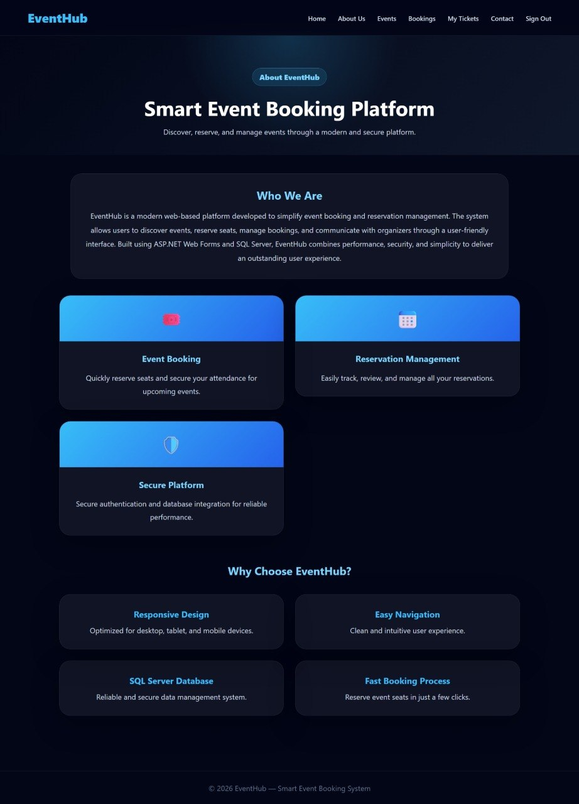
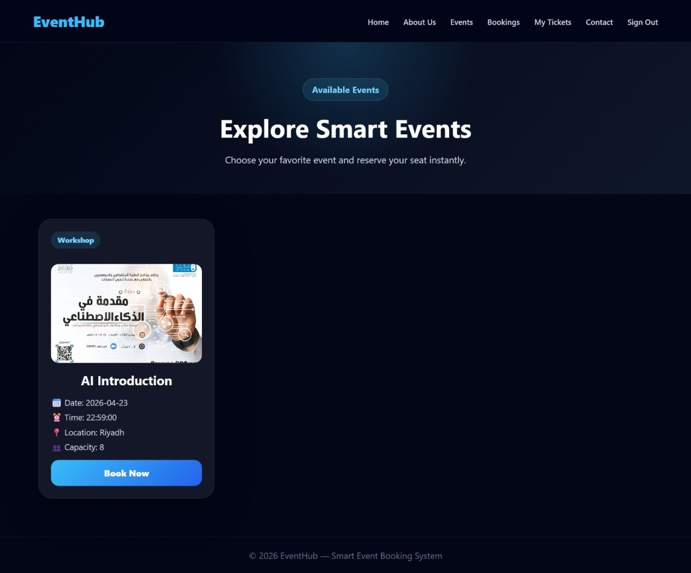
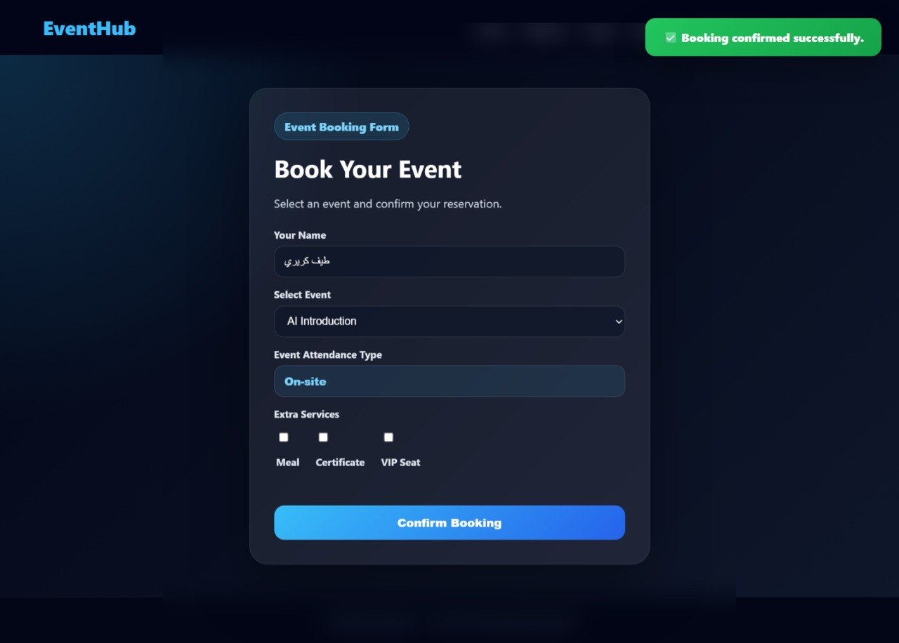
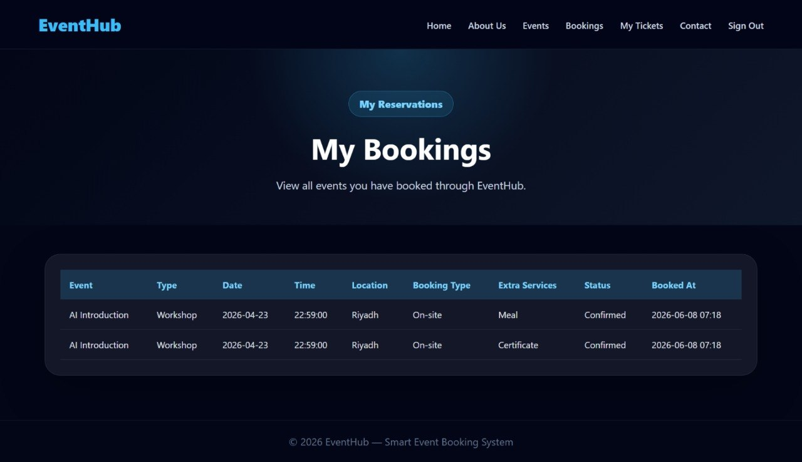
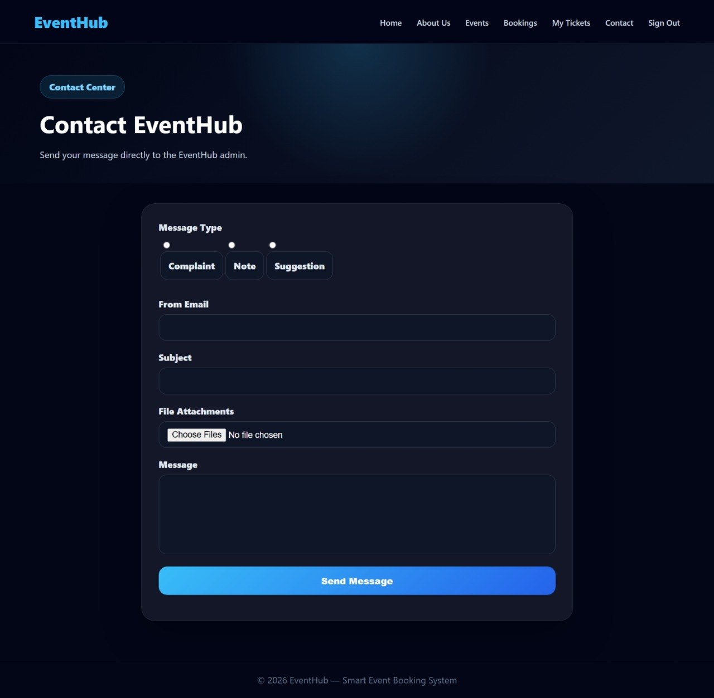
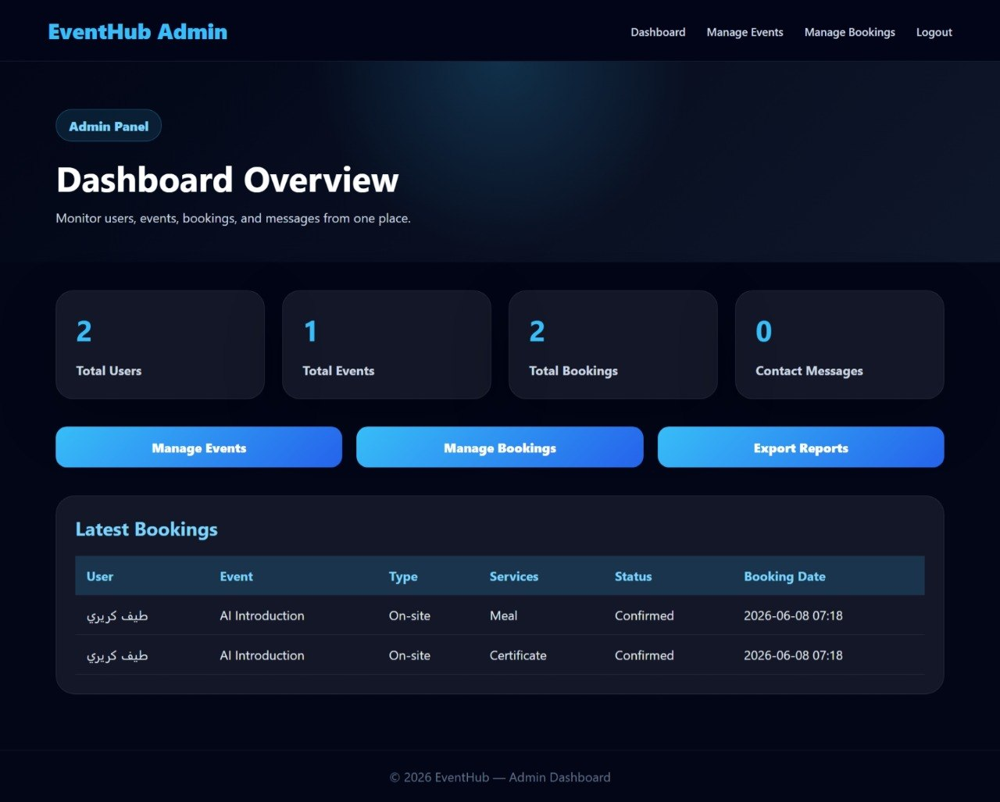
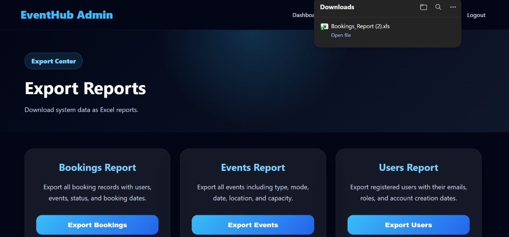
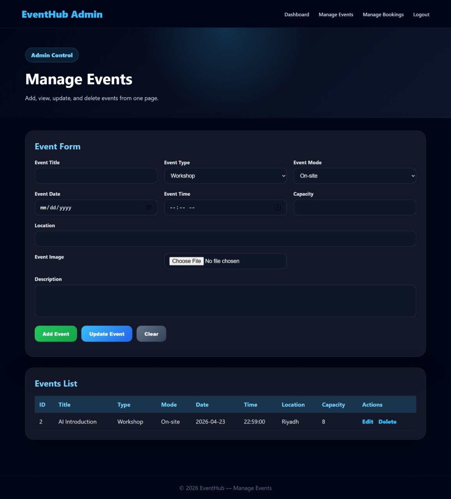
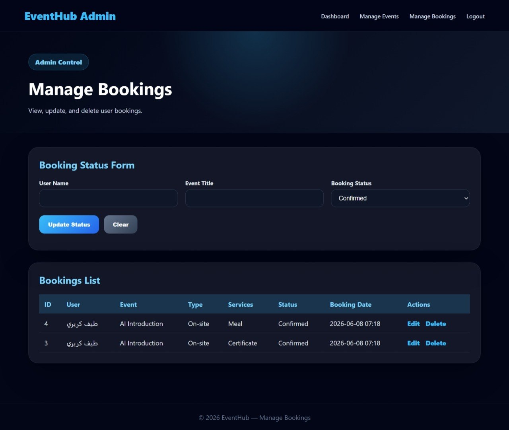

# EventHub — Event Management and Booking Platform

EventHub is a modern web application built using C# (ASP.NET Web Forms) and SQL Server. The platform is designed to provide a complete event management solution that allows users to browse events, reserve seats, and manage their bookings through a simple and organized interface.

This project demonstrates practical full-stack development skills, including database integration, authentication systems, CRUD operations, reporting features, and responsive user interface design.

---

# Project Overview

EventHub provides a complete environment that enables users to discover upcoming events, view event details, reserve seats, and track their bookings through a centralized platform.

The platform features a modern user-friendly interface and a secure authentication system to ensure a smooth and reliable user experience.

This project addresses the challenge of organizing event registration and management by providing an efficient digital solution for both attendees and administrators.

---

# Project Screenshots

.jpg)

.jpg)

.jpg)

---

# Technologies Used

C# (ASP.NET Web Forms)

Used to build the core system logic, authentication workflow, and backend operations.

SQL Server

Stores all system data, including users, events, bookings, and contact requests.

ADO.NET

Manages database connections and CRUD operations between the application and SQL Server.

Visual Studio

Serves as the primary IDE for developing, testing, and debugging the application.

---

# Key Features

User Registration and Login

Secure authentication system that supports account creation and login for platform users.

Browse Events

Users can explore available events with detailed information and event images.

Event Booking System

Allows users to reserve event seats quickly and efficiently.

My Bookings

Users can view and manage their reserved events through a dedicated bookings page.

Contact Support Form

Built-in communication form for inquiries, suggestions, and support requests.

Admin Dashboard

Provides administrators with full control over managing events and monitoring bookings.

Full CRUD Event Management

Administrators can create, update, delete, and manage events through a dedicated management panel.

Booking Management

Administrators can track and manage all event reservations within the system.

Excel Report Export

Generate and export reports for events, users, and bookings.

---

# What This Project Demonstrates

• Ability to build complete real-world systems using C# and SQL Server.

• Experience implementing authentication, CRUD operations, and database integration.

• Strong understanding of database design and data management.

• Skill in developing modern multi-page web applications.

• Practical experience in designing user-friendly interfaces and administrative dashboards.

• Capability to organize, develop, and deliver a functional full-stack project.

---

# Developer

Taif M. Kareeri — TeefDev
